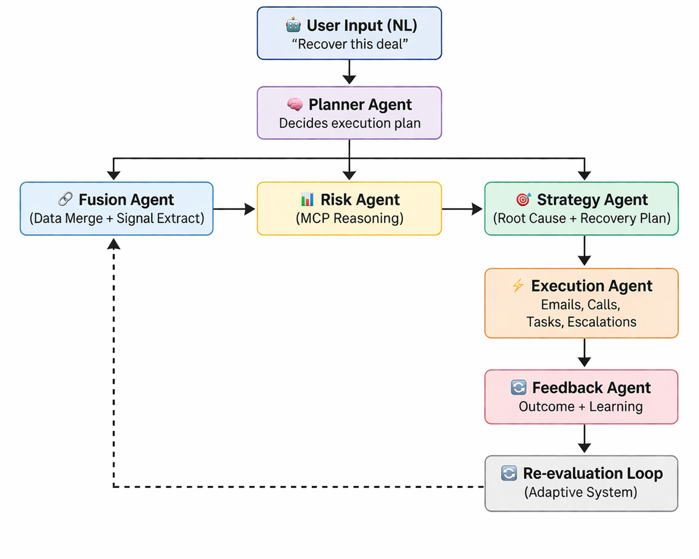

# Autonomous Multi-Agent Deal Risk & Recovery AI

An end-to-end **autonomous AI system** that monitors deals, detects risks, generates recovery strategies, executes actions (emails, calls), and continuously improves via feedback loops.

## Demo

(https://drive.google.com/drive/folders/1y5dV8c7Mh3ygpirXYUKzCKI3Yqsmtogz?usp=sharing&authuser=1&hl=en)

## Problem

Sales teams lose deals due to:
- Lack of proactive follow-ups  
- Engagement drop-offs  
- Competitive pressure  
- Poor visibility into deal health  

Traditional CRMs (like Salesforce, HubSpot) are **passive dashboards**, they do not **reason, act, or recover deals automatically**.

## Solution

We built a **multi-agent autonomous system** that:

- Monitors CRM, emails, engagement, and market signals  
- Detects deal risk using multi-context reasoning (MCP)  
- Identifies root causes of deal failure  
- Generates recovery strategies  
- Executes actions (emails, call scripts, follow-ups)  
- Learns from outcomes via feedback loops  
- Streams decisions in real-time  

## System Architecture

## Agents Overview

### Planner Agent
- Converts user intent into execution plan  
- Enables dynamic workflows  

### Fusion + Signal Agent
- Merges CRM, emails, engagement, and market data  
- Extracts signals such as:
  - engagement health  
  - reply latency  
  - objections  
  - competitor mentions  

### Risk Agent (MCP)
- Performs reasoning across multiple contexts:
  - deal data  
  - engagement signals  
  - market conditions  

Outputs:
- risk score  
- confidence  
- contributing factors  
- detailed reasoning  

### Strategy Agent
- Identifies root causes of deal risk  
- Generates multi-step recovery plan  
- Suggests communication strategies  

### Execution Agent
- Generates:
  - emails  
  - call scripts  
  - follow-ups  
- Executes or simulates actions  

### Feedback Agent
- Captures outcomes:
  - reply  
  - no response  
  - negative outcome  
- Updates signals and triggers re-evaluation  

## Orchestration (LangGraph-inspired)

The system uses a **hybrid orchestration model**:

- Graph-based execution  
- Planner-driven dynamic routing  
- Stateful execution between agents  
- Real-time streaming of outputs  
- Feedback-driven re-evaluation loop  

This enables **true autonomy**, not just sequential processing.

## Features

- Natural language control (e.g., "recover this deal")  
- Real-time agent execution streaming  
- Risk scoring with explainability  
- Strategy generation with root causes  
- Automated email and call script generation  
- Feedback loop with adaptive behavior  
- Streamlit dashboard for visualization  

## Project Structure

autonomous-deal-ai/  
├── agents/  
│   ├── planner_agent.py  
│   ├── fusion_agent.py  
│   ├── risk_agent.py  
│   ├── strategy_agent.py  
│   ├── execution_agent.py  
│   ├── feedback_agent.py  
│   └── portfolio_agent.py  
│  
├── orchestration/  
│   └── engine.py  
│  
├── frontend/  
│   └── app.py  
│  
├── data/  
│   └── raw/  
│       ├── crm_deals.json  
│       ├── emails.json  
│       ├── engagement.json  
│       └── market.json  
│  
├── utils/  
│   ├── llm.py  
│   ├── parser.py  
│   └── prompts.py  
│  
└── run.py  

## Setup Instructions

### 1. Clone the Repository
git clone <your-repo-url>  
cd autonomous-deal-ai  

### 2. Create Environment
conda create -n agenv python=3.10  
conda activate agenv  

### 3. Install Dependencies
pip install -r requirements.txt  

### 4. Add API Key

Create a `.env` file:

GEMINI_API_KEY=your_api_key_here  

### 5. Run Frontend
streamlit run frontend/app.py  

## Impact Model

### Assumptions
- Average deal size = $100,000  
- Total deals = 100  
- At-risk deals = 30%  

### Without System
30 deals × $100k × 30% win rate = $900,000  

### With System
30 deals × $100k × 50% win rate = $1,500,000  

### Revenue Recovered
$600,000 per 100 deals  

## Time Savings

- Manual follow-ups ≈ 200 hours  
- Automated system handles ≈ 80%  

Result:
- 160 hours saved per cycle  

## Key Highlights

- Fully autonomous multi-agent system  
- Executes actions, not just insights  
- Real-time streaming decision pipeline  
- Feedback-driven self-improving system  
- Quantifiable business impact  

## Future Improvements

- CRM integrations (Salesforce API)  
- Email automation (SMTP / Gmail API)  
- Slack / Teams alerts  
- Reinforcement learning for optimization  
- Multi-deal portfolio intelligence  

## Final Thought

This is not just an AI assistant 
it is an **autonomous revenue recovery system**.
